# 微信小程序在线购物系统 - 系统架构设计文档

## 文档信息
- **项目名称**: 微信小程序在线购物系统
- **文档版本**: v1.0
- **创建日期**: 2026-03-04
- **技术基础**: TDesign 零售模板

---

## 目录
1. [系统总体架构](#1-系统总体架构)
2. [技术选型](#2-技术选型)
3. [系统功能模块设计](#3-系统功能模块设计)
4. [接口设计规范](#4-接口设计规范)
5. [数据流向设计](#5-数据流向设计)
6. [安全设计](#6-安全设计)
7. [性能优化设计](#7-性能优化设计)
8. [扩展性设计](#8-扩展性设计)
9. [监控与日志](#9-监控与日志)

---

## 1. 系统总体架构

### 1.1 整体架构图

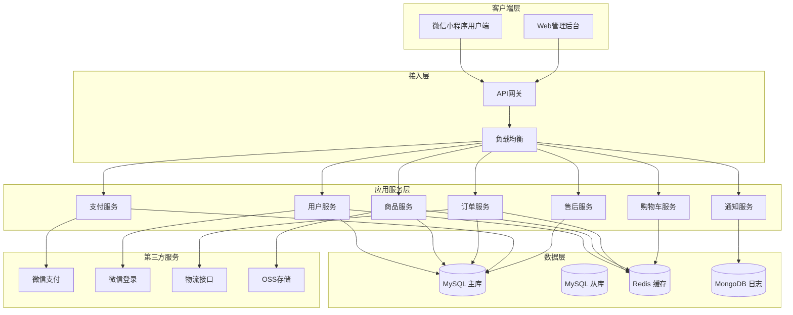

### 1.2 前后端分离架构

系统采用标准的前后端分离架构：

**客户端层**
- **微信小程序端**: 用户购物界面，使用微信小程序原生框架开发
- **Web管理端**: 运营人员管理界面，使用 Vue3/React + TDesign 开发

**服务端层**
- **API网关**: 统一入口，负责路由、鉴权、限流、日志
- **业务服务**: 按业务领域拆分的微服务模块
- **数据访问层**: 统一的数据访问接口（DAO/Repository）

**数据层**
- **关系型数据库**: 存储核心业务数据
- **缓存数据库**: 提供高性能数据缓存
- **文档数据库**: 存储日志和非结构化数据

### 1.3 微服务模块划分

```
购物系统微服务架构
├── 用户服务 (user-service)
│   ├── 用户注册/登录
│   ├── 用户信息管理
│   ├── 收货地址管理
│   └── 实名认证
│
├── 商品服务 (product-service)
│   ├── 商品管理
│   ├── 分类管理
│   ├── 规格管理
│   ├── 库存管理
│   └── 搜索服务
│
├── 购物车服务 (cart-service)
│   ├── 购物车操作
│   ├── 数量修改
│   ├── 选中状态管理
│   └── 失效商品清理
│
├── 订单服务 (order-service)
│   ├── 订单创建
│   ├── 订单查询
│   ├── 订单状态流转
│   └── 订单统计
│
├── 支付服务 (payment-service)
│   ├── 支付接口对接
│   ├── 支付回调处理
│   ├── 退款处理
│   └── 对账系统
│
├── 售后服务 (after-sale-service)
│   ├── 退款/退货申请
│   ├── 售后审核
│   ├── 退款处理
│   └── 售后统计
│
├── 物流服务 (logistics-service)
│   ├── 配送费用管理
│   ├── 物流跟踪
│   ├── 发货管理
│   └── 区域配置
│
└── 通知服务 (notification-service)
    ├── 消息模板管理
    ├── 站内消息
    ├── 微信模板消息
    └── 短信通知
```

---

## 2. 技术选型

### 2.1 前端技术栈

#### 微信小程序端
| 技术 | 版本 | 说明 |
|------|------|------|
| 微信小程序原生框架 | 稳定版 | 官方框架，性能最优 |
| TDesign 小程序组件库 | 最新版 | 腾讯优质UI组件库 |
| TypeScript | ^4.9 | 类型安全 |
| Vite | ^4.0 | 构建工具 |

**核心依赖**
```json
{
  "dependencies": {
    "tdesign-miniprogram": "^1.5.0",
    "@vant/weapp": "^1.11.6"
  },
  "devDependencies": {
    "@typescript-eslint/parser": "^5.0",
    "eslint": "^8.0",
    "miniprogram-api-typings": "^3.12.0"
  }
}
```

#### Web管理端
| 技术 | 版本 | 说明 |
|------|------|------|
| Vue 3 | ^3.3 | 渐进式框架 |
| TDesign Vue Next | 最新版 | 企业级UI组件库 |
| Vite | ^4.0 | 构建工具 |
| Vue Router | ^4.0 | 路由管理 |
| Pinia | ^2.0 | 状态管理 |
| TypeScript | ^5.0 | 类型安全 |
| VueUse | ^10.0 | 组合式工具集 |

### 2.2 后端技术栈

#### 推荐方案一：Node.js 微服务架构
| 技术 | 版本 | 说明 |
|------|------|------|
| Node.js | ^18 LTS | 运行时环境 |
| NestJS | ^10.0 | 企业级框架 |
| TypeORM | ^0.3 | ORM框架 |
| MySQL | ^8.0 | 关系型数据库 |
| Redis | ^7.0 | 缓存数据库 |
| RabbitMQ | ^3.12 | 消息队列 |

**优势**
- 统一的 TypeScript 技术栈
- 微服务架构支持完善
- 高并发处理能力强
- 适合快速迭代

#### 推荐方案二：微信云开发
| 技术 | 说明 |
|------|------|
| 微信云开发 | 免运维、自动扩缩容 |
| 云函数 | 无需管理服务器 |
| 云数据库 | MongoDB 免费额度 |
| 云存储 | 图片/文件存储 |
| 云调用 | 免鉴权调用微信API |

**优势**
- 开箱即用，降低运维成本
- 与微信生态深度集成
- 免费额度适合小规模应用
- 快速部署和迭代

### 2.3 数据库选型

#### MySQL - 核心业务数据
**使用场景**
- 用户信息
- 商品信息
- 订单数据
- 交易记录
- 地址信息

**表结构设计原则**
- 遵循第三范式
- 适当冗余以优化查询
- 使用软删除
- 统一时间戳字段

#### Redis - 缓存与会话
**使用场景**
- 用户 Session 存储
- 购物车数据缓存
- 商品详情缓存
- 热点商品缓存
- 分布式锁
- 限流计数器
- 排行榜数据

**数据结构选择**
```javascript
// String: 简单键值对
SET user:session:123 "token_data"

// Hash: 对象存储
HSET product:info:1001 name "商品A" price 99.00 stock 100

// List: 列表数据
LPUSH user:cart:123 "{\"product_id\":1001,\"count\":2}"

// Set: 唯一集合
SADD user:favorites:123 1001 1002 1003

// ZSet: 有序集合（排行榜）
ZADD product:rank:hot 1000 1001 800 1002
```

#### MongoDB - 日志与非结构化数据
**使用场景**
- 系统操作日志
- 用户行为日志
- API调用日志
- 异步任务日志

### 2.4 其他中间件

#### 消息队列 - RabbitMQ
**使用场景**
- 订单创建后的异步处理
- 库存扣减消息
- 支付结果通知
- 售后申请处理
- 数据同步任务

**队列设计**
```
订单队列 (order.queue)
- 订单创建消息
- 订单支付消息
- 订单完成消息

库存队列 (stock.queue)
- 库存预占消息
- 库存扣减消息
- 库存回滚消息

通知队列 (notification.queue)
- 短信通知消息
- 模板消息通知
- 站内消息通知
```

#### 日志收集 - Winston + ELK
```javascript
// 日志级别
enum LogLevel {
  ERROR = 0,    // 错误日志
  WARN = 1,     // 警告日志
  INFO = 2,     // 信息日志
  DEBUG = 3,    // 调试日志
  VERBOSE = 4   // 详细日志
}
```

#### 文件存储 - 阿里云OSS / 腾讯云COS
**存储策略**
- 商品图片: CDN加速 + 缩略图
- 用户头像: 独立存储桶
- 临时文件: 定期清理
- 访问控制: 私有读 + 签名URL

---

## 3. 系统功能模块设计

### 3.1 用户认证模块

#### 3.1.1 功能清单
| 功能 | 描述 | 优先级 |
|------|------|--------|
| 手机号注册 | 通过手机号+验证码注册 | P0 |
| 邮箱注册 | 通过邮箱+验证码注册 | P1 |
| 微信授权登录 | 微信一键登录，自动注册 | P0 |
| 密码登录 | 账号密码登录 | P0 |
| 找回密码 | 通过手机/邮箱找回 | P0 |
| 实名认证 | 身份信息认证（可选） | P2 |
| 第三方登录 | 支持QQ、支付宝等 | P2 |

#### 3.1.2 注册流程
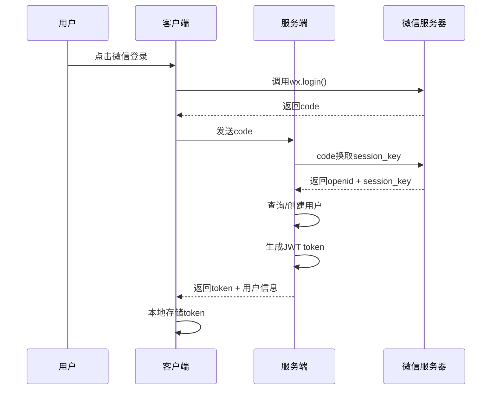

#### 3.1.3 数据表设计
```sql
-- 用户表
CREATE TABLE `users` (
  `id` bigint NOT NULL AUTO_INCREMENT COMMENT '用户ID',
  `openid` varchar(64) DEFAULT NULL COMMENT '微信openid',
  `unionid` varchar(64) DEFAULT NULL COMMENT '微信unionid',
  `phone` varchar(20) DEFAULT NULL COMMENT '手机号',
  `email` varchar(100) DEFAULT NULL COMMENT '邮箱',
  `password` varchar(255) DEFAULT NULL COMMENT '密码(加密)',
  `nickname` varchar(50) DEFAULT NULL COMMENT '昵称',
  `avatar` varchar(255) DEFAULT NULL COMMENT '头像URL',
  `gender` tinyint DEFAULT 0 COMMENT '性别 0未知 1男 2女',
  `birthday` date DEFAULT NULL COMMENT '生日',
  `real_name` varchar(50) DEFAULT NULL COMMENT '真实姓名',
  `id_card` varchar(18) DEFAULT NULL COMMENT '身份证号',
  `is_verified` tinyint DEFAULT 0 COMMENT '是否实名认证',
  `status` tinyint DEFAULT 1 COMMENT '状态 0禁用 1正常',
  `last_login_time` datetime DEFAULT NULL COMMENT '最后登录时间',
  `last_login_ip` varchar(50) DEFAULT NULL COMMENT '最后登录IP',
  `created_at` datetime NOT NULL DEFAULT CURRENT_TIMESTAMP,
  `updated_at` datetime NOT NULL DEFAULT CURRENT_TIMESTAMP ON UPDATE CURRENT_TIMESTAMP,
  `deleted_at` datetime DEFAULT NULL,
  PRIMARY KEY (`id`),
  UNIQUE KEY `uk_openid` (`openid`),
  UNIQUE KEY `uk_phone` (`phone`),
  UNIQUE KEY `uk_email` (`email`),
  KEY `idx_status` (`status`)
) ENGINE=InnoDB DEFAULT CHARSET=utf8mb4 COMMENT='用户表';
```

### 3.2 商品管理模块

#### 3.2.1 功能清单
| 功能 | 描述 | 优先级 |
|------|------|--------|
| 商品列表 | 分页查询商品 | P0 |
| 商品搜索 | 关键词、分类、价格区间搜索 | P0 |
| 商品详情 | 商品详细信息展示 | P0 |
| 分类导航 | 多级分类展示 | P0 |
| 商品推荐 | 首页推荐、个性化推荐 | P0 |
| 规格选择 | 多规格商品选择 | P0 |
| 库存查询 | 实时库存显示 | P0 |

#### 3.2.2 数据表设计
```sql
-- 商品分类表
CREATE TABLE `categories` (
  `id` bigint NOT NULL AUTO_INCREMENT,
  `parent_id` bigint DEFAULT 0 COMMENT '父分类ID',
  `name` varchar(50) NOT NULL COMMENT '分类名称',
  `icon` varchar(255) DEFAULT NULL COMMENT '分类图标',
  `sort` int DEFAULT 0 COMMENT '排序',
  `level` tinyint DEFAULT 1 COMMENT '层级',
  `path` varchar(255) DEFAULT NULL COMMENT '路径',
  `status` tinyint DEFAULT 1 COMMENT '状态',
  `created_at` datetime NOT NULL DEFAULT CURRENT_TIMESTAMP,
  `updated_at` datetime NOT NULL DEFAULT CURRENT_TIMESTAMP ON UPDATE CURRENT_TIMESTAMP,
  PRIMARY KEY (`id`),
  KEY `idx_parent_id` (`parent_id`),
  KEY `idx_status` (`status`)
) ENGINE=InnoDB DEFAULT CHARSET=utf8mb4 COMMENT='商品分类表';

-- 商品表
CREATE TABLE `products` (
  `id` bigint NOT NULL AUTO_INCREMENT,
  `category_id` bigint NOT NULL COMMENT '分类ID',
  `name` varchar(100) NOT NULL COMMENT '商品名称',
  `subtitle` varchar(200) DEFAULT NULL COMMENT '副标题',
  `main_image` varchar(255) NOT NULL COMMENT '主图',
  `images` json DEFAULT NULL COMMENT '图片列表',
  `detail` text COMMENT '商品详情HTML',
  `price` decimal(10,2) NOT NULL COMMENT '价格',
  `original_price` decimal(10,2) DEFAULT NULL COMMENT '原价',
  `cost_price` decimal(10,2) DEFAULT NULL COMMENT '成本价',
  `stock` int NOT NULL DEFAULT 0 COMMENT '总库存',
  `sales` int DEFAULT 0 COMMENT '销量',
  `sort` int DEFAULT 0 COMMENT '排序',
  `is_hot` tinyint DEFAULT 0 COMMENT '是否热销',
  `is_new` tinyint DEFAULT 0 COMMENT '是否新品',
  `is_recommend` tinyint DEFAULT 0 COMMENT '是否推荐',
  `status` tinyint DEFAULT 1 COMMENT '状态 0下架 1上架',
  `created_at` datetime NOT NULL DEFAULT CURRENT_TIMESTAMP,
  `updated_at` datetime NOT NULL DEFAULT CURRENT_TIMESTAMP ON UPDATE CURRENT_TIMESTAMP,
  `deleted_at` datetime DEFAULT NULL,
  PRIMARY KEY (`id`),
  KEY `idx_category_id` (`category_id`),
  KEY `idx_status` (`status`),
  KEY `idx_is_hot` (`is_hot`),
  KEY `idx_is_recommend` (`is_recommend`)
) ENGINE=InnoDB DEFAULT CHARSET=utf8mb4 COMMENT='商品表';

-- 商品规格表
CREATE TABLE `product_skus` (
  `id` bigint NOT NULL AUTO_INCREMENT,
  `product_id` bigint NOT NULL COMMENT '商品ID',
  `sku_code` varchar(50) NOT NULL COMMENT 'SKU编码',
  `specs` json NOT NULL COMMENT '规格属性',
  `price` decimal(10,2) NOT NULL COMMENT '价格',
  `stock` int NOT NULL DEFAULT 0 COMMENT '库存',
  `image` varchar(255) DEFAULT NULL COMMENT '规格图片',
  `status` tinyint DEFAULT 1 COMMENT '状态',
  `created_at` datetime NOT NULL DEFAULT CURRENT_TIMESTAMP,
  `updated_at` datetime NOT NULL DEFAULT CURRENT_TIMESTAMP ON UPDATE CURRENT_TIMESTAMP,
  PRIMARY KEY (`id`),
  UNIQUE KEY `uk_sku_code` (`sku_code`),
  KEY `idx_product_id` (`product_id`)
) ENGINE=InnoDB DEFAULT CHARSET=utf8mb4 COMMENT='商品规格表';
```

### 3.3 购物车模块

#### 3.3.1 功能清单
| 功能 | 描述 | 优先级 |
|------|------|--------|
| 添加商品 | 添加商品到购物车 | P0 |
| 修改数量 | 增加/减少商品数量 | P0 |
| 删除商品 | 删除购物车商品 | P0 |
| 清空购物车 | 一键清空 | P0 |
| 选择商品 | 单选/全选操作 | P0 |
| 失效处理 | 商品下架/库存不足处理 | P0 |
| 价格计算 | 实时计算总价 | P0 |

#### 3.3.2 数据存储方案
```javascript
// Redis存储结构
CART_KEY = 'cart:{userId}'

// 数据结构
{
  "items": [
    {
      "skuId": 1001,
      "productId": 100,
      "name": "商品A",
      "image": "https://...",
      "specs": {"颜色": "红色", "尺码": "L"},
      "price": 99.00,
      "count": 2,
      "selected": true,
      "stock": 50,
      "valid": true
    }
  ],
  "totalPrice": 198.00,
  "totalCount": 2,
  "updatedAt": "2026-03-04 10:00:00"
}
```

### 3.4 订单模块

#### 3.4.1 订单状态流转
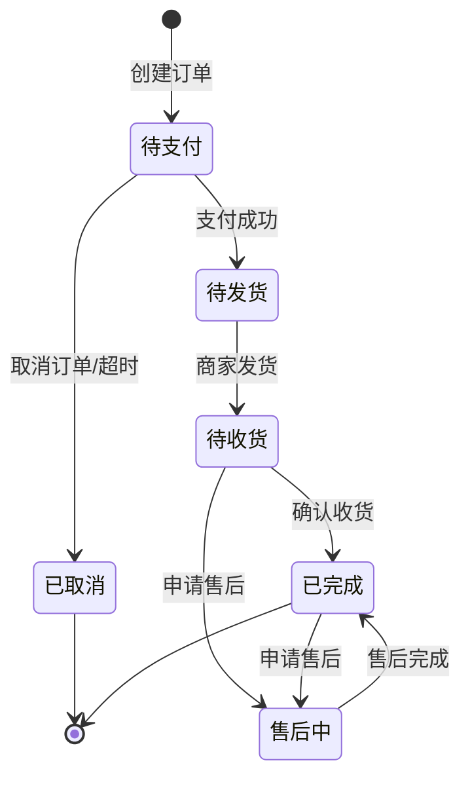

#### 3.4.2 数据表设计
```sql
-- 订单表
CREATE TABLE `orders` (
  `id` bigint NOT NULL AUTO_INCREMENT,
  `order_no` varchar(32) NOT NULL COMMENT '订单号',
  `user_id` bigint NOT NULL COMMENT '用户ID',
  `status` tinyint NOT NULL DEFAULT 0 COMMENT '订单状态 0待支付 1待发货 2待收货 3已完成 4已取消 5售后中',
  `total_amount` decimal(10,2) NOT NULL COMMENT '商品总金额',
  `freight_amount` decimal(10,2) NOT NULL DEFAULT 0 COMMENT '运费',
  `discount_amount` decimal(10,2) NOT NULL DEFAULT 0 COMMENT '优惠金额',
  `pay_amount` decimal(10,2) NOT NULL COMMENT '实付金额',
  `pay_type` varchar(20) DEFAULT NULL COMMENT '支付方式',
  `pay_time` datetime DEFAULT NULL COMMENT '支付时间',
  `consignee` varchar(50) NOT NULL COMMENT '收货人',
  `phone` varchar(20) NOT NULL COMMENT '收货电话',
  `province` varchar(50) NOT NULL COMMENT '省',
  `city` varchar(50) NOT NULL COMMENT '市',
  `district` varchar(50) NOT NULL COMMENT '区',
  `address` varchar(255) NOT NULL COMMENT '详细地址',
  `remark` varchar(500) DEFAULT NULL COMMENT '订单备注',
  `created_at` datetime NOT NULL DEFAULT CURRENT_TIMESTAMP,
  `updated_at` datetime NOT NULL DEFAULT CURRENT_TIMESTAMP ON UPDATE CURRENT_TIMESTAMP,
  `deleted_at` datetime DEFAULT NULL,
  PRIMARY KEY (`id`),
  UNIQUE KEY `uk_order_no` (`order_no`),
  KEY `idx_user_id` (`user_id`),
  KEY `idx_status` (`status`),
  KEY `idx_created_at` (`created_at`)
) ENGINE=InnoDB DEFAULT CHARSET=utf8mb4 COMMENT='订单表';

-- 订单商品表
CREATE TABLE `order_items` (
  `id` bigint NOT NULL AUTO_INCREMENT,
  `order_id` bigint NOT NULL COMMENT '订单ID',
  `product_id` bigint NOT NULL COMMENT '商品ID',
  `sku_id` bigint NOT NULL COMMENT 'SKU ID',
  `product_name` varchar(100) NOT NULL COMMENT '商品名称',
  `sku_image` varchar(255) NOT NULL COMMENT '商品图片',
  `specs` json DEFAULT NULL COMMENT '规格属性',
  `price` decimal(10,2) NOT NULL COMMENT '单价',
  `count` int NOT NULL COMMENT '数量',
  `total_amount` decimal(10,2) NOT NULL COMMENT '小计',
  `created_at` datetime NOT NULL DEFAULT CURRENT_TIMESTAMP,
  PRIMARY KEY (`id`),
  KEY `idx_order_id` (`order_id`)
) ENGINE=InnoDB DEFAULT CHARSET=utf8mb4 COMMENT='订单商品表';
```

### 3.5 支付模块

#### 3.5.1 支付流程
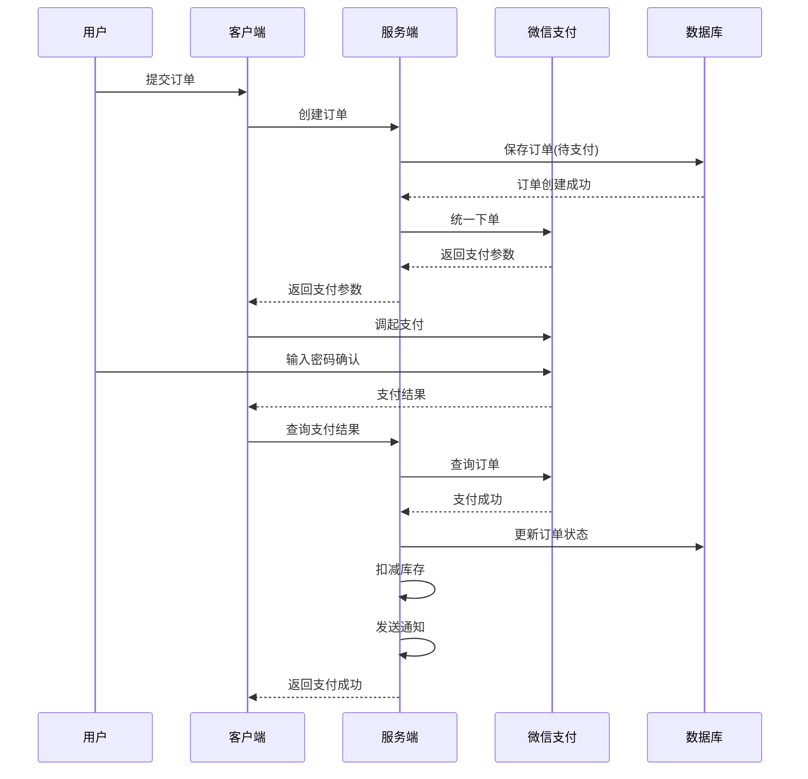

#### 3.5.2 支付状态管理
```javascript
// 支付状态枚举
enum PaymentStatus {
  UNPAID = 0,        // 未支付
  PAYING = 1,        // 支付中
  PAID = 2,          // 已支付
  FAILED = 3,        // 支付失败
  REFUNDING = 4,     // 退款中
  REFUNDED = 5,      // 已退款
  PARTIAL_REFUNDED = 6 // 部分退款
}
```

### 3.6 物流模块

#### 3.6.1 配送费用管理
```sql
-- 配送费用表
CREATE TABLE `freight_templates` (
  `id` bigint NOT NULL AUTO_INCREMENT,
  `name` varchar(50) NOT NULL COMMENT '模板名称',
  `charge_type` tinyint NOT NULL DEFAULT 1 COMMENT '计费方式 1按件数 2按重量 3按体积',
  `freight_type` tinyint NOT NULL DEFAULT 1 COMMENT '运费类型 1固定运费 2模板运费',
  `default_freight` decimal(10,2) NOT NULL DEFAULT 0 COMMENT '默认运费',
  `free_condition` tinyint DEFAULT 0 COMMENT '包邮条件 0不包邮 1满额包邮 2满件包邮',
  `free_amount` decimal(10,2) DEFAULT NULL COMMENT '包邮金额',
  `free_count` int DEFAULT NULL COMMENT '包邮件数',
  `created_at` datetime NOT NULL DEFAULT CURRENT_TIMESTAMP,
  `updated_at` datetime NOT NULL DEFAULT CURRENT_TIMESTAMP ON UPDATE CURRENT_TIMESTAMP,
  PRIMARY KEY (`id`)
) ENGINE=InnoDB DEFAULT CHARSET=utf8mb4 COMMENT='配送费用模板';

-- 区域配送费用表
CREATE TABLE `freight_regions` (
  `id` bigint NOT NULL AUTO_INCREMENT,
  `template_id` bigint NOT NULL COMMENT '模板ID',
  `province` varchar(50) NOT NULL COMMENT '省份',
  `city` varchar(50) DEFAULT NULL COMMENT '城市',
  `district` varchar(50) DEFAULT NULL COMMENT '区县',
  `first_unit` int NOT NULL DEFAULT 1 COMMENT '首件/首重',
  `first_freight` decimal(10,2) NOT NULL COMMENT '首费',
  `continue_unit` int NOT NULL DEFAULT 1 COMMENT '续件/续重',
  `continue_freight` decimal(10,2) NOT NULL COMMENT '续费',
  `created_at` datetime NOT NULL DEFAULT CURRENT_TIMESTAMP,
  PRIMARY KEY (`id`),
  KEY `idx_template_id` (`template_id`)
) ENGINE=InnoDB DEFAULT CHARSET=utf8mb4 COMMENT='区域配送费用';
```

### 3.7 售后模块

#### 3.7.1 售后类型
| 类型 | 说明 | 处理时效 |
|------|------|----------|
| 仅退款 | 未发货或无需退货 | 24小时内 |
| 退货退款 | 需要寄回商品 | 7天内完成退款 |
| 换货 | 商品质量问题 | 7天内完成换货 |

#### 3.7.2 数据表设计
```sql
-- 售后申请表
CREATE TABLE `after_sales` (
  `id` bigint NOT NULL AUTO_INCREMENT,
  `order_id` bigint NOT NULL COMMENT '订单ID',
  `order_item_id` bigint NOT NULL COMMENT '订单商品ID',
  `user_id` bigint NOT NULL COMMENT '用户ID',
  `type` tinyint NOT NULL COMMENT '售后类型 1仅退款 2退货退款 3换货',
  `reason` varchar(200) NOT NULL COMMENT '售后原因',
  `description` varchar(500) DEFAULT NULL COMMENT '问题描述',
  `images` json DEFAULT NULL COMMENT '凭证图片',
  `refund_amount` decimal(10,2) NOT NULL COMMENT '退款金额',
  `status` tinyint NOT NULL DEFAULT 0 COMMENT '状态 0待审核 1已同意 2已拒绝 3退款中 4已完成 5已取消',
  `audit_remark` varchar(500) DEFAULT NULL COMMENT '审核备注',
  `audit_time` datetime DEFAULT NULL COMMENT '审核时间',
  `refund_time` datetime DEFAULT NULL COMMENT '退款时间',
  `created_at` datetime NOT NULL DEFAULT CURRENT_TIMESTAMP,
  `updated_at` datetime NOT NULL DEFAULT CURRENT_TIMESTAMP ON UPDATE CURRENT_TIMESTAMP,
  PRIMARY KEY (`id`),
  KEY `idx_order_id` (`order_id`),
  KEY `idx_user_id` (`user_id`),
  KEY `idx_status` (`status`)
) ENGINE=InnoDB DEFAULT CHARSET=utf8mb4 COMMENT='售后申请表';
```

### 3.8 通知模块

#### 3.8.1 通知渠道
| 渠道 | 场景 | 优先级 |
|------|------|--------|
| 站内消息 | 全部通知 | P0 |
| 微信模板消息 | 订单状态、支付成功 | P0 |
| 短信 | 验证码、重要通知 | P0 |
| 邮件 | 账单、周报 | P1 |

#### 3.8.2 消息模板设计
```javascript
// 订单支付成功模板
const ORDER_PAID_TEMPLATE = {
  templateId: 'xxxxx',
  data: {
    thing1: { value: '商品名称' },
    amount2: { value: '99.00' },
    date3: { value: '2026-03-04 10:00:00' }
  }
}

// 发货提醒模板
const ORDER_SHIPPED_TEMPLATE = {
  templateId: 'xxxxx',
  data: {
    thing1: { value: '顺丰速运' },
    character_string2: { value: 'SF1234567890' },
    thing3: { value: '正在配送中' }
  }
}
```

---

## 4. 接口设计规范

### 4.1 RESTful API 规范

#### 4.1.1 URL设计规范
```
基础域名: https://api.example.com/v1

资源命名规范（复数形式）:
GET    /api/v1/users          # 获取用户列表
GET    /api/v1/users/{id}     # 获取单个用户
POST   /api/v1/users          # 创建用户
PUT    /api/v1/users/{id}     # 更新用户(全部)
PATCH  /api/v1/users/{id}     # 更新用户(部分)
DELETE /api/v1/users/{id}     # 删除用户

嵌套资源:
GET    /api/v1/users/{id}/orders       # 获取用户的订单
POST   /api/v1/users/{id}/orders       # 为用户创建订单
GET    /api/v1/orders/{id}/items       # 获取订单的商品

操作资源:
POST   /api/v1/cart/items/{id}/select  # 选中购物车商品
POST   /api/v1/orders/{id}/pay         # 订单支付
POST   /api/v1/orders/{id}/cancel      # 取消订单
```

#### 4.1.2 HTTP方法语义
| 方法 | 说明 | 幂等性 | 安全性 |
|------|------|--------|--------|
| GET | 查询资源 | 是 | 是 |
| POST | 创建资源 | 否 | 否 |
| PUT | 全量更新资源 | 是 | 否 |
| PATCH | 部分更新资源 | 否 | 否 |
| DELETE | 删除资源 | 是 | 否 |

### 4.2 请求/响应格式

#### 4.2.1 请求头规范
```http
# 标准请求头
Content-Type: application/json
Accept: application/json
Authorization: Bearer {token}
X-Request-ID: {uuid}
X-Client-Version: 1.0.0
X-Device-ID: {device_id}
```

#### 4.2.2 统一响应格式
```json
// 成功响应
{
  "code": 0,
  "message": "success",
  "data": {
    "id": 1,
    "name": "商品A"
  },
  "timestamp": 1709529600
}

// 分页响应
{
  "code": 0,
  "message": "success",
  "data": {
    "items": [...],
    "pagination": {
      "page": 1,
      "pageSize": 20,
      "total": 100,
      "totalPages": 5
    }
  },
  "timestamp": 1709529600
}

// 错误响应
{
  "code": 10001,
  "message": "参数验证失败",
  "errors": [
    {
      "field": "phone",
      "message": "手机号格式不正确"
    }
  ],
  "timestamp": 1709529600
}
```

### 4.3 错误码定义

#### 4.3.1 错误码规范
```
错误码格式: {业务模块}{错误类型}{具体错误}

业务模块:
00 - 通用
01 - 用户模块
02 - 商品模块
03 - 订单模块
04 - 支付模块
05 - 售后模块

错误类型:
0 - 成功
1 - 参数错误
2 - 业务逻辑错误
3 - 系统错误
4 - 第三方服务错误
```

#### 4.3.2 常用错误码列表
| 错误码 | 说明 | HTTP状态码 |
|--------|------|------------|
| 0 | 成功 | 200 |
| 10001 | 参数验证失败 | 400 |
| 10002 | 缺少必需参数 | 400 |
| 10101 | 用户不存在 | 404 |
| 10102 | 用户已存在 | 400 |
| 10103 | 密码错误 | 401 |
| 10104 | Token无效 | 401 |
| 10105 | Token过期 | 401 |
| 10201 | 商品不存在 | 404 |
| 10202 | 商品已下架 | 400 |
| 10203 | 库存不足 | 400 |
| 10301 | 订单不存在 | 404 |
| 10302 | 订单状态错误 | 400 |
| 10303 | 订单已超时 | 400 |
| 10401 | 支付失败 | 400 |
| 10402 | 支付金额不匹配 | 400 |
| 10501 | 售后申请已存在 | 400 |
| 50001 | 服务器内部错误 | 500 |
| 50002 | 数据库错误 | 500 |
| 50003 | 缓存错误 | 500 |
| 50004 | 第三方服务异常 | 502 |

### 4.4 接口版本控制

#### 4.4.1 版本策略
```
URL版本控制（推荐）:
https://api.example.com/v1/users
https://api.example.com/v2/users

请求头版本控制:
Accept: application/vnd.example.v1+json
```

#### 4.4.2 版本兼容性
- **大版本变更**: 不兼容旧版本，如 v1 → v2
- **小版本更新**: 向后兼容，如 v1.0 → v1.1
- **废弃策略**: 提前6个月通知，保留旧版本3个月

---

## 5. 数据流向设计

### 5.1 用户注册/登录流程

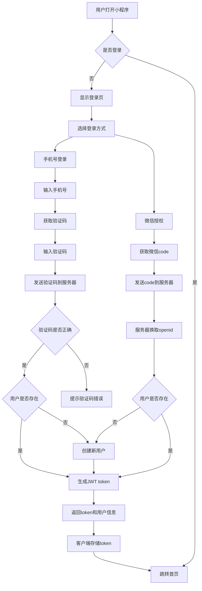

### 5.2 购物流程

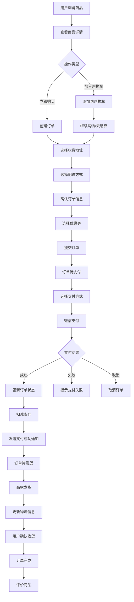

### 5.3 售后流程

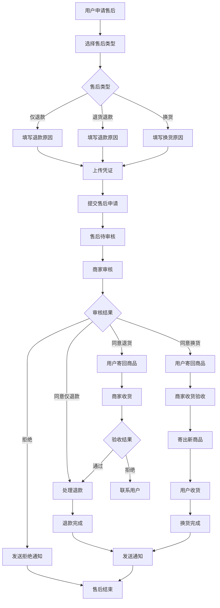

### 5.4 数据流转图

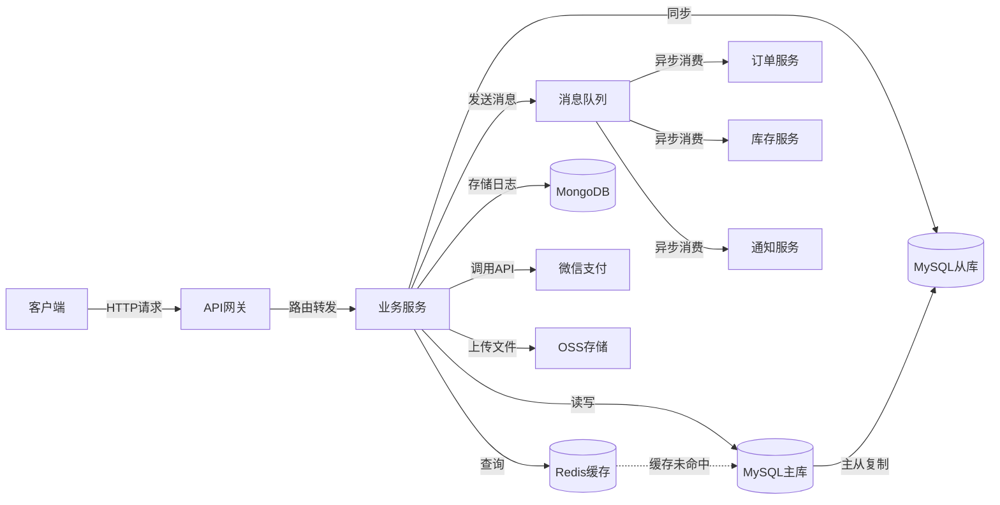

---

## 6. 安全设计

### 6.1 用户认证与授权

#### 6.1.1 JWT Token设计
```javascript
// Token结构
{
  "header": {
    "alg": "HS256",
    "typ": "JWT"
  },
  "payload": {
    "user_id": 123,
    "openid": "xxxxx",
    "role": "user",
    "iat": 1709529600,
    "exp": 1709616000
  },
  "signature": "..."
}

// Access Token: 有效期2小时
// Refresh Token: 有效期7天
```

#### 6.1.2 Token刷新机制
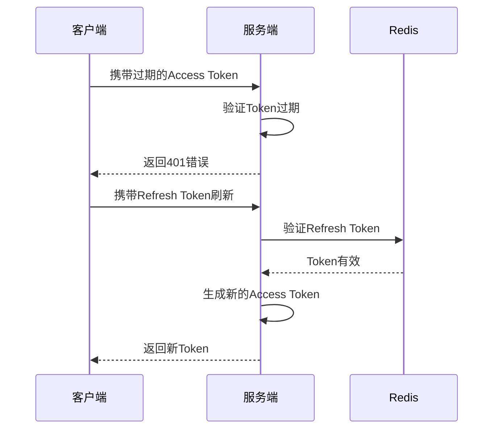

#### 6.1.3 权限控制
```typescript
// RBAC权限模型
enum UserRole {
  ADMIN = 'admin',        // 超级管理员
  OPERATOR = 'operator',  // 运营人员
  USER = 'user'           // 普通用户
}

// 权限装饰器
@RequireRoles(UserRole.ADMIN)
async deleteProduct(@Param('id') id: number) {
  // 只有管理员可删除
}

// 权限中间件
function checkPermission(required: UserRole) {
  return (req, res, next) => {
    if (req.user.role === required || req.user.role === UserRole.ADMIN) {
      next()
    } else {
      res.status(403).json({ code: 403, message: '无权限访问' })
    }
  }
}
```

### 6.2 数据加密

#### 6.2.1 密码加密
```typescript
import bcrypt from 'bcrypt'

// 注册时加密
async hashPassword(password: string): Promise<string> {
  const salt = await bcrypt.genSalt(10)
  return bcrypt.hash(password, salt)
}

// 登录时验证
async verifyPassword(password: string, hash: string): Promise<boolean> {
  return bcrypt.compare(password, hash)
}
```

#### 6.2.2 敏感数据加密
```typescript
import crypto from 'crypto'

// AES加密
function encrypt(text: string, key: string): string {
  const iv = crypto.randomBytes(16)
  const cipher = crypto.createCipheriv('aes-256-cbc', Buffer.from(key, 'hex'), iv)
  let encrypted = cipher.update(text, 'utf8', 'hex')
  encrypted += cipher.final('hex')
  return iv.toString('hex') + ':' + encrypted
}

// 加密字段：手机号、身份证、银行卡
```

#### 6.2.3 HTTPS通信
- 生产环境强制HTTPS
- TLS 1.2及以上版本
- 定期更新SSL证书
- 配置HSTS头

### 6.3 接口签名

#### 6.3.1 签名算法
```javascript
// 1. 参数排序
// 2. 拼接字符串
// 3. 添加时间戳和随机数
// 4. HMAC-SHA256签名

function sign(params, secret) {
  // 按key排序
  const sorted = Object.keys(params).sort()

  // 拼接
  const str = sorted.map(key => `${key}=${params[key]}`).join('&')

  // 添加时间戳
  const data = str + '&timestamp=' + Date.now()

  // 签名
  return crypto.createHmac('sha256', secret).update(data).digest('hex')
}
```

#### 6.3.2 防重放攻击
```typescript
// 时间戳验证（5分钟内有效）
if (Math.abs(Date.now() - timestamp) > 5 * 60 * 1000) {
  throw new Error('请求已过期')
}

// 随机数去重（Redis存储已使用的nonce）
const exists = await redis.exists(`nonce:${nonce}`)
if (exists) {
  throw new Error('重复请求')
}
await redis.setex(`nonce:${nonce}`, 300, '1')
```

### 6.4 防刷机制

#### 6.4.1 接口限流
```typescript
// 令牌桶算法
import rateLimit from 'express-rate-limit'

const limiter = rateLimit({
  windowMs: 60 * 1000,    // 1分钟
  max: 100,                // 最多100次请求
  message: '请求过于频繁，请稍后再试',
  standardHeaders: true,
  legacyHeaders: false,
})

// 不同接口不同限制
const strictLimiter = rateLimit({
  windowMs: 60 * 1000,
  max: 5,                  // 严格限制（如发送验证码）
})
```

#### 6.4.2 验证码防刷
```typescript
// 短信验证码限制
async function sendVerifyCode(phone: string) {
  // 1分钟内只能发送1次
  const recent = await redis.get(`sms:recent:${phone}`)
  if (recent) {
    throw new Error('请勿频繁发送')
  }

  // 1天内最多发送10次
  const count = await redis.get(`sms:count:${phone}`)
  if (parseInt(count) >= 10) {
    throw new Error('今日发送次数已达上限')
  }

  // 发送验证码
  const code = Math.random().toString().slice(2, 8)
  await sendSMS(phone, code)

  // 记录
  await redis.setex(`sms:recent:${phone}`, 60, '1')
  await redis.incr(`sms:count:${phone}`)
  await redis.expire(`sms:count:${phone}`, 86400)
  await redis.setex(`sms:code:${phone}`, 300, code) // 5分钟有效
}
```

#### 6.4.3 IP黑名单
```typescript
// 检测恶意IP
async function checkBlacklist(ip: string) {
  const isBlacklisted = await redis.sismember('ip:blacklist', ip)
  if (isBlacklisted) {
    throw new Error('IP已被封禁')
  }
}

// 自动加入黑名单
async function autoBan(ip: string) {
  // 10分钟内失败100次
  const key = `ip:fail:${ip}`
  const count = await redis.incr(key)

  if (count === 1) {
    await redis.expire(key, 600)
  }

  if (count >= 100) {
    await redis.sadd('ip:blacklist', ip)
    await redis.expire('ip:blacklist', 3600) // 封禁1小时
  }
}
```

### 6.5 支付安全

#### 6.5.1 支付验证
```typescript
// 1. 金额验证
if (order.payAmount !== paidAmount) {
  throw new Error('支付金额不匹配')
}

// 2. 订单状态验证
if (order.status !== OrderStatus.UNPAID) {
  throw new Error('订单状态异常')
}

// 3. 支付超时验证
if (Date.now() - order.createdAt.getTime() > 30 * 60 * 1000) {
  throw new Error('订单已超时')
}

// 4. 微信签名验证
const sign = generateWeChatSign(params)
if (sign !== receivedSign) {
  throw new Error('签名验证失败')
}
```

#### 6.5.2 异步通知验签
```typescript
// 微信支付回调验签
app.post('/api/payment/notify', async (req, res) => {
  const { transaction_id, out_trade_no, total_fee, sign } = req.body

  // 验证签名
  const computedSign = computeWeChatSign(req.body)
  if (computedSign !== sign) {
    return res.status(400).send('FAIL')
  }

  // 处理支付结果
  await handlePaymentSuccess(out_trade_no)

  // 返回成功
  res.send('SUCCESS')
})
```

---

## 7. 性能优化设计

### 7.1 缓存策略

#### 7.1.1 多级缓存架构
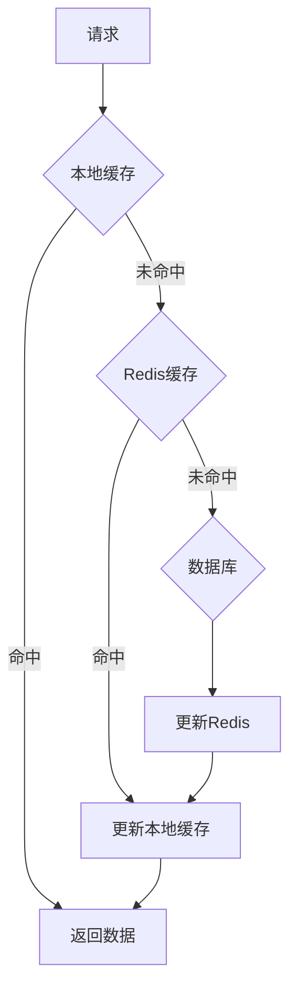

#### 7.1.2 缓存使用场景
| 数据类型 | 缓存位置 | 过期时间 | 更新策略 |
|---------|---------|----------|----------|
| 商品详情 | Redis | 1小时 | 修改时删除 |
| 商品列表 | Redis | 30分钟 | 定时刷新 |
| 分类树 | 本地+Redis | 1天 | 修改时删除 |
| 购物车 | Redis | 7天 | 操作时更新 |
| 用户信息 | Redis | 2小时 | 修改时删除 |
| 配置信息 | 本地 | 永久 | 重启加载 |
| 热点商品 | Redis | 10分钟 | LRU淘汰 |

#### 7.1.3 缓存更新策略
```typescript
// Cache-Aside Pattern
async function getProduct(id: number) {
  // 1. 先查缓存
  let product = await redis.get(`product:${id}`)
  if (product) {
    return JSON.parse(product)
  }

  // 2. 缓存未命中，查数据库
  product = await db.query('SELECT * FROM products WHERE id = ?', [id])

  // 3. 写入缓存
  await redis.setex(`product:${id}`, 3600, JSON.stringify(product))

  return product
}

// 更新时删除缓存
async function updateProduct(id: number, data: any) {
  // 1. 更新数据库
  await db.query('UPDATE products SET ? WHERE id = ?', [data, id])

  // 2. 删除缓存
  await redis.del(`product:${id}`)

  // 可选：更新其他关联缓存
  await redis.del('products:hot')
}
```

### 7.2 数据库优化

#### 7.2.1 索引优化
```sql
-- 商品表索引
CREATE INDEX idx_category_status ON products(category_id, status);
CREATE INDEX idx_price ON products(price);
CREATE INDEX idx_sales ON products(sales DESC);
CREATE FULLTEXT INDEX idx_name_desc ON products(name, subtitle);

-- 订单表索引
CREATE INDEX idx_user_status ON orders(user_id, status);
CREATE INDEX idx_created_at ON orders(created_at DESC);
CREATE INDEX idx_order_no ON orders(order_no);

-- 组合索引优化（注意最左前缀原则）
CREATE INDEX idx_user_status_time ON orders(user_id, status, created_at);
```

#### 7.2.2 分页优化
```sql
-- 传统分页（深分页性能差）
SELECT * FROM orders ORDER BY id LIMIT 100000, 20;

-- 优化方案1：使用上次查询的最大ID
SELECT * FROM orders WHERE id > 100000 ORDER BY id LIMIT 20;

-- 优化方案2：延迟关联
SELECT o.* FROM orders o
INNER JOIN (SELECT id FROM orders ORDER BY id LIMIT 100000, 20) tmp
ON o.id = tmp.id;

-- 优化方案3：使用ES做搜索
```

#### 7.2.3 读写分离
```typescript
// 主从配置
const masterDB = {
  host: 'master.example.com',
  user: 'root',
  password: 'password',
  database: 'shop'
}

const slaveDB = {
  host: 'slave.example.com',
  user: 'root',
  password: 'password',
  database: 'shop'
}

// 读操作走从库
function query(sql: string, params: any[]) {
  return slaveDB.query(sql, params)
}

// 写操作走主库
function execute(sql: string, params: any[]) {
  return masterDB.query(sql, params)
}
```

### 7.3 CDN加速

#### 7.3.1 静态资源CDN
```
CDN配置：
- 图片资源：img.example.com
- JS/CSS：static.example.com
- API：api.example.com

缓存策略：
- 图片：1年
- JS/CSS：1个月（带版本号）
- HTML：不缓存
```

#### 7.3.2 图片优化
```typescript
// 图片处理服务
function getImageUrl(originalUrl: string, options: ImageOptions) {
  const { width, height, quality = 80, format = 'webp' } = options

  // 使用阿里云/腾讯云图片处理
  return `${originalUrl}?x-oss-process=image/resize,w_${width},h_${height}/quality,q_${quality}/format,${format}`
}

// 响应式图片
// 小图：320x320, 50KB
// 中图：640x640, 100KB
// 大图：1280x1280, 200KB
```

### 7.4 并发处理

#### 7.4.1 库存扣减
```typescript
// 使用Redis原子操作
async function decreaseStock(skuId: number, count: number) {
  const key = `stock:${skuId}`

  // Lua脚本保证原子性
  const lua = `
    local stock = redis.call('GET', KEYS[1])
    if not stock then
      return -1
    end
    stock = tonumber(stock)
    if stock < tonumber(ARGV[1]) then
      return 0
    end
    redis.call('DECRBY', KEYS[1], ARGV[1])
    return 1
  `

  const result = await redis.eval(lua, 1, key, count)
  if (result === 0) {
    throw new Error('库存不足')
  }

  // 异步同步到数据库
  await messageQueue.publish('stock.update', { skuId, count })
}
```

#### 7.4.2 秒杀系统
```typescript
// 秒杀商品预热
async function preloadSeckill(productId: number) {
  const product = await db.query('SELECT * FROM products WHERE id = ?', [productId])

  // 库存预热到Redis
  await redis.set(`seckill:stock:${productId}`, product.stock)

  // 本地缓存
  localCache.set(`seckill:product:${productId}`, product)
}

// 秒杀下单
async function seckillOrder(userId: number, productId: number) {
  // 1. 本地限流
  if (!localCache.acquireToken(productId)) {
    throw new Error('请求过于频繁')
  }

  // 2. Redis原子扣减
  const stock = await redis.decr(`seckill:stock:${productId}`)
  if (stock < 0) {
    await redis.incr(`seckill:stock:${productId}`) // 回滚
    throw new Error('已售罄')
  }

  // 3. 创建订单（异步）
  await messageQueue.publish('seckill.order', { userId, productId })

  return { orderId: generateOrderId() }
}
```

### 7.5 性能监控指标

```typescript
// 关键性能指标
const performanceMetrics = {
  // 响应时间
  responseTime: {
    p50: '< 100ms',
    p95: '< 300ms',
    p99: '< 500ms'
  },

  // 吞吐量
  throughput: {
    qps: '1000+',
    peakQPS: '5000+'
  },

  // 错误率
  errorRate: '< 0.1%',

  // 可用性
  availability: '99.9%',

  // 缓存命中率
  cacheHitRate: '> 85%',

  // 数据库慢查询
  slowQuery: '< 1% (>100ms)'
}
```

---

## 8. 扩展性设计

### 8.1 横向扩展能力

#### 8.1.1 无状态服务
```typescript
// 所有服务无状态设计
// Session存储在Redis
// 文件存储在OSS
// 配置集中管理

// 便于弹性伸缩
// 根据负载自动增减实例
```

#### 8.1.2 数据库分库分表
```sql
-- 水平分表策略
-- 按用户ID取模分表
orders_0, orders_1, orders_2, ... orders_9

-- 按时间分表
orders_2026_01, orders_2026_02, orders_2026_03, ...

-- 分库分表中间件：ShardingSphere / MyCAT
```

#### 8.1.3 服务拆分
```
单体应用 → 微服务

阶段1：单体应用
阶段2：前后端分离
阶段3：服务拆分（订单、商品、用户）
阶段4：微服务化（完整微服务架构）
```

### 8.2 模块化设计

#### 8.2.1 前端模块化
```typescript
// 小程序模块化结构
src/
├── modules/
│   ├── user/           # 用户模块
│   │   ├── api.ts
│   │   ├── types.ts
│   │   └── store.ts
│   ├── product/        # 商品模块
│   ├── cart/           # 购物车模块
│   ├── order/          # 订单模块
│   └── payment/        # 支付模块
├── components/         # 公共组件
├── utils/             # 工具函数
└── styles/            # 全局样式
```

#### 8.2.2 后端模块化
```typescript
// NestJS模块化
@Module({
  imports: [
    UserModule,
    ProductModule,
    OrderModule,
    PaymentModule,
    CartModule,
    AfterSaleModule
  ],
  controllers: [AppController],
  providers: [AppService],
})
export class AppModule {}

// 每个模块独立
// 便于开发、测试、部署
```

### 8.3 配置化管理

#### 8.3.1 环境配置
```typescript
// config/env.dev.ts
export const devConfig = {
  database: {
    host: 'localhost',
    port: 3306,
    username: 'root',
    password: 'password',
    database: 'shop_dev'
  },
  redis: {
    host: 'localhost',
    port: 6379
  },
  oss: {
    accessKeyId: 'xxx',
    accessKeySecret: 'xxx',
    bucket: 'dev-bucket'
  }
}

// config/env.prod.ts
export const prodConfig = {
  database: {
    host: 'prod.example.com',
    // ...
  }
}
```

#### 8.3.2 动态配置中心
```typescript
// 使用Nacos/Apollo配置中心
// 支持配置热更新
async function getConfig(key: string) {
  // 从配置中心获取
  const value = await nacos.getConfig(key)

  // 本地缓存
  await redis.setex(`config:${key}`, 60, value)

  return value
}

// 监听配置变化
nacos.subscribeConfig('payment.rate', (newValue) => {
  // 热更新，无需重启
  paymentRate = parseFloat(newValue)
})
```

### 8.4 多租户支持

```sql
-- SaaS多租户设计
CREATE TABLE `tenants` (
  `id` bigint NOT NULL AUTO_INCREMENT,
  `name` varchar(100) NOT NULL COMMENT '租户名称',
  `domain` varchar(100) DEFAULT NULL COMMENT '独立域名',
  `logo` varchar(255) DEFAULT NULL COMMENT '租户logo',
  `config` json DEFAULT NULL COMMENT '租户配置',
  `status` tinyint DEFAULT 1 COMMENT '状态',
  `expired_at` datetime DEFAULT NULL COMMENT '过期时间',
  `created_at` datetime NOT NULL DEFAULT CURRENT_TIMESTAMP,
  PRIMARY KEY (`id`),
  UNIQUE KEY `uk_domain` (`domain`)
) ENGINE=InnoDB DEFAULT CHARSET=utf8mb4 COMMENT='租户表';

-- 所有业务表添加tenant_id
ALTER TABLE users ADD COLUMN tenant_id bigint NOT NULL;
CREATE INDEX idx_tenant_id ON users(tenant_id);
```

---

## 9. 监控与日志

### 9.1 日志收集方案

#### 9.1.1 日志分类
```typescript
enum LogLevel {
  ERROR = 0,    // 错误日志：系统错误、异常
  WARN = 1,     // 警告日志：异常但可恢复
  INFO = 2,     // 信息日志：关键业务操作
  DEBUG = 3,    // 调试日志：开发调试用
}

// 日志格式
{
  "timestamp": "2026-03-04 10:00:00",
  "level": "INFO",
  "service": "order-service",
  "traceId": "abc123",
  "userId": 1001,
  "action": "create_order",
  "message": "订单创建成功",
  "data": {
    "orderId": 12345,
    "amount": 99.00
  },
  "cost": 150  // 耗时ms
}
```

#### 9.1.2 日志收集架构


#### 9.1.3 关键日志记录
```typescript
// 用户操作日志
logger.info('user_action', {
  userId: 1001,
  action: 'login',
  ip: '192.168.1.1',
  userAgent: 'Mozilla/5.0...'
})

// 订单日志
logger.info('order_created', {
  orderId: 12345,
  userId: 1001,
  amount: 99.00,
  items: [...]
})

// 支付日志
logger.info('payment_success', {
  orderId: 12345,
  transactionId: 'wx123456',
  amount: 99.00,
  payTime: '2026-03-04 10:00:00'
})

// 错误日志
logger.error('system_error', {
  error: err.message,
  stack: err.stack,
  context: { orderId: 12345 }
})
```

### 9.2 监控指标

#### 9.2.1 应用监控
```typescript
// Prometheus + Grafana
const metrics = {
  // QPS
  qps: 'sum(rate(http_requests_total[1m]))',

  // 响应时间
  responseTime: 'histogram_quantile(0.95, http_request_duration_seconds)',

  // 错误率
  errorRate: 'sum(rate(http_requests_total{status=~"5.."}[5m])) / sum(rate(http_requests_total[5m]))',

  // JVM/Node.js内存
  memoryUsage: 'process_resident_memory_bytes',

  // CPU使用率
  cpuUsage: 'rate(process_cpu_seconds_total[1m])',

  // 连接池
  dbConnections: 'pg_stat_activity_count',
  redisConnections: 'redis_connected_clients'
}
```

#### 9.2.2 业务监控
```typescript
// 关键业务指标
const businessMetrics = {
  // 订单量
  orderCount: 'order_created_total',

  // GMV（成交总额）
  gmv: 'order_amount_total',

  // 支付成功率
  paymentSuccessRate: 'payment_success_total / payment_init_total',

  // 用户活跃度
  activeUsers: 'unique_user_id',

  // 商品转化率
  conversionRate: 'order_created_total / product_view_total'
}
```

#### 9.2.3 告警规则
```yaml
# alerting rules
groups:
  - name: api_alerts
    rules:
      # 高错误率告警
      - alert: HighErrorRate
        expr: rate(http_requests_total{status=~"5.."}[5m]) > 0.05
        for: 5m
        annotations:
          summary: "API错误率过高"

      # 慢查询告警
      - alert: SlowQuery
        expr: histogram_quantile(0.95, http_request_duration_seconds) > 1
        for: 10m
        annotations:
          summary: "API响应时间过长"

      # 服务宕机告警
      - alert: ServiceDown
        expr: up == 0
        for: 1m
        annotations:
          summary: "服务不可用"
```

### 9.3 分布式追踪

#### 9.3.1 链路追踪
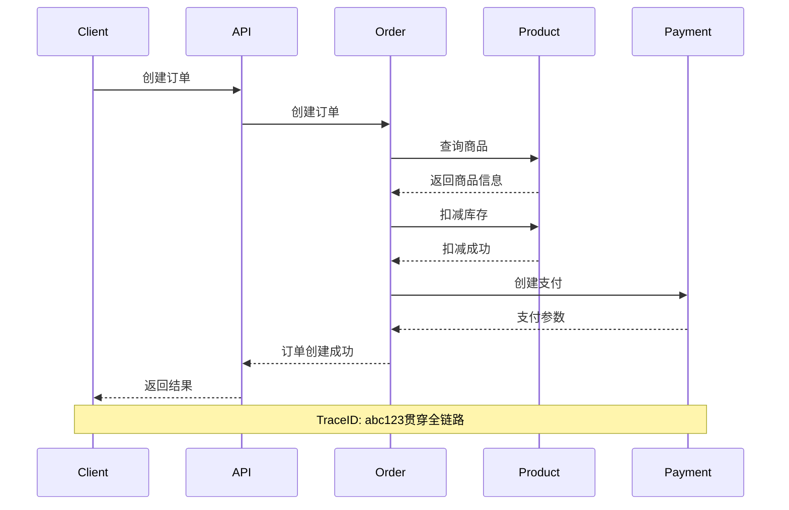

#### 9.3.2 Jaeger集成
```typescript
import { Tracer } from 'jaeger-client'

// 初始化追踪器
const tracer = new Tracer({
  serviceName: 'order-service',
  reporter: {
    agentHost: 'localhost',
    agentPort: 6831
  }
})

// 创建span
const span = tracer.startSpan('create_order')
span.setTag('user_id', 1001)
span.setTag('order_id', 12345)

// 嵌套span
const childSpan = tracer.startSpan('check_stock', { childOf: span })
// ... 业务逻辑
childSpan.finish()

span.finish()
```

### 9.4 健康检查

```typescript
// 健康检查端点
@Get('health')
async healthCheck() {
  const checks = {
    status: 'ok',
    timestamp: new Date(),
    services: {
      database: await this.checkDatabase(),
      redis: await this.checkRedis(),
      rabbitmq: await this.checkRabbitMQ(),
      external: {
        wechat: await this.checkWeChatAPI(),
        aliyun: await this.checkAliyunOSS()
      }
    }
  }

  // 如果所有检查通过，返回200，否则返回503
  const isHealthy = Object.values(checks.services)
    .every(service => service.status === 'ok')

  return isHealthy ? checks : new ServiceUnavailable()
}
```

---

## 10. 部署架构

### 10.1 生产环境架构

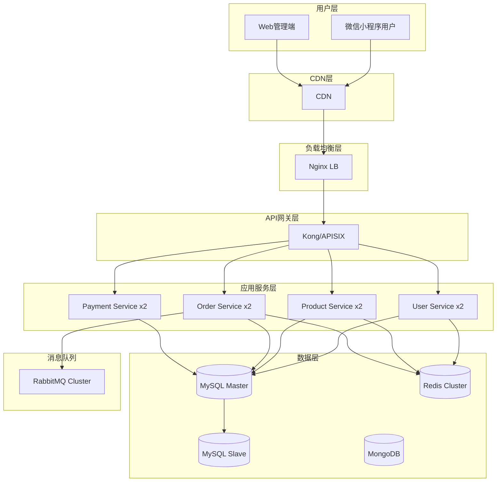

### 10.2 Docker容器化

```dockerfile
# Dockerfile
FROM node:18-alpine

WORKDIR /app

COPY package*.json ./
RUN npm ci --only=production

COPY . .
RUN npm run build

EXPOSE 3000

CMD ["npm", "run", "start:prod"]
```

```yaml
# docker-compose.yml
version: '3.8'
services:
  api:
    build: .
    ports:
      - "3000:3000"
    environment:
      - NODE_ENV=production
      - DB_HOST=mysql
      - REDIS_HOST=redis
    depends_on:
      - mysql
      - redis

  mysql:
    image: mysql:8.0
    environment:
      MYSQL_ROOT_PASSWORD: password
      MYSQL_DATABASE: shop
    volumes:
      - mysql-data:/var/lib/mysql

  redis:
    image: redis:7-alpine
    volumes:
      - redis-data:/data

  nginx:
    image: nginx:alpine
    ports:
      - "80:80"
    volumes:
      - ./nginx.conf:/etc/nginx/nginx.conf
    depends_on:
      - api

volumes:
  mysql-data:
  redis-data:
```

### 10.3 CI/CD流程

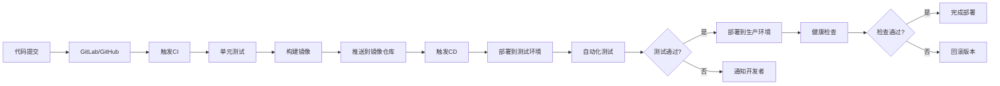

---

## 11. 附录

### 11.1 名词解释

| 术语 | 说明 |
|------|------|
| JWT | JSON Web Token，用于身份验证 |
| RBAC | 基于角色的访问控制 |
| CDN | 内容分发网络 |
| OSS | 对象存储服务 |
| QPS | 每秒查询率 |
| TPS | 每秒事务数 |
| SLA | 服务水平协议 |
| GMV | 成交总额 |

### 11.2 参考资料

- [微信小程序开发文档](https://developers.weixin.qq.com/miniprogram/dev/framework/)
- [TDesign 组件库](https://tdesign.tencent.com/)
- [NestJS 官方文档](https://docs.nestjs.com/)
- [MySQL 8.0 Reference](https://dev.mysql.com/doc/refman/8.0/en/)
- [Redis 命令参考](https://redis.io/commands)
- [RESTful API 设计指南](https://restfulapi.net/)

### 11.3 版本历史

| 版本 | 日期 | 修改内容 | 修改人 |
|------|------|----------|--------|
| v1.0 | 2026-03-04 | 初始版本 | System |

---

**文档结束**
